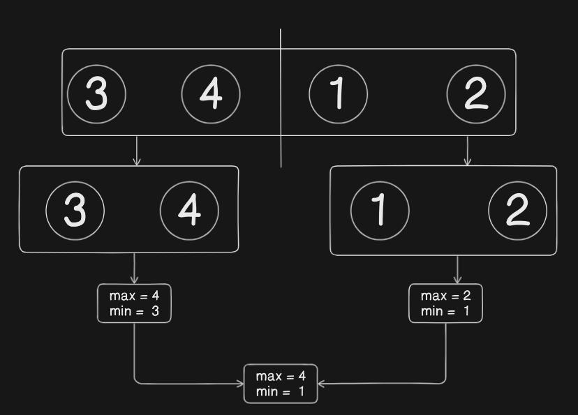

# Algoritmo de Seleção de Valor Máximo e Mínimo

## Descrição
Este projeto consiste na implementação do algoritmo de seleção de valores máximo e mínimo provenientes de um array passado como parâmetro de entrada. Esse código utilizada a técnica da divisão e conquista e foi implementado de maneira recursiva.
Dessa forma, o array é dividido em arrays menores que são resolvidos recursivamente até alcançar o caso base de existir somente um único valor no array. Com isso, esse método reduz o número de comparações necessárias em
comparação com uma abordagem iterativa.

## Versão do Python
Este projeto foi desenvolvido na versão Python 3.11.9 do Python.

## Como executar
1 - Clone o repositório do GitHub para sua máquina local.
```
git clone https://github.com/gabrielreisresende/max-min-recursive-selector.git
```
2 - Certifique-se de que Python 3.x está instalado em seu sistema.  <br>
3 - Navegue até o diretório do projeto através do terminal ou prompt de comando.  <br>
4 - Execute o arquivo main.py com o comando:
```
python main.py
```

## Implementação 

### 1. Definição da função:
```python
def select_max_and_min(array, min_value, max_value):
```

- A função select_max_and_min recebe três parâmetros:

    - array: a lista de números que você deseja analisar.

    - min_value: o valor mínimo inicial para comparação.

    - max_value: o valor máximo inicial para comparação.

### 2. Caso base da recursão:
```python
if len(array) == 1:
    min_value = min(min_value, array[0])
    max_value = max(max_value, array[0])
    return min_value, max_value
```

- Quando o array contém apenas um elemento, a função compara o elemento com os valores atuais de min_value e max_value:

    - Atualiza min_value se o valor no array for menor.

    - Atualiza max_value se o valor no array for maior.

    - Retorna os valores de min_value e max_value atualizados.

### 3. Divisão do array:
```python
mid = len(array) // 2
left = array[:mid]
right = array[mid:]
```

- O array é dividido em dois subarrays:

    - left: contém os elementos da metade inicial..

    - right: contém os elementos da metade final.


### 4. Recursão para a metade esquerda do array:
```python
min_value, max_value = select_max_and_min(left, min_value, max_value)
```

- A função é chamada recursivamente para o subarray left, atualizando min_value e max_value com os valores encontrados na primeira metade do array.


### 5. Recursão para a metade direita do array:
```python
min_value, max_value = select_max_and_min(left, min_value, max_value)
```

-  A função é chamada recursivamente para o subarray right, atualizando min_value e max_value com os valores encontrados na segunda metade do array.


### 6. Retorno dos valores finais de min_value e max_value:
```python
return min_value, max_value
```
- Retorna os valores finais mínimo e máximo, respectivamente, após ter analisado recursivamente as duas metades do array.

## Saída da Execução


## Relatório Técnico - Complexidade Assíntótica

A complexidade assintótica é fundamental para entender como o algoritmo escala com a entrada de dados, em termos de tempo (temporal) e espaço (espacial) requerido.

## Contagem de Operações

A análise da complexidade assintótica do algoritmo select_max_and_min pode ser feita pelo método de contagem de operações,
considerando as comparações realizadas durante o processo recursivo. <br>

1) Um array de tamanho n é dividido em duas metades de tamanho n/2.
2) Após isso, são feitas chamdas recursivas, primeiramente, para a parte da esquerda e, depois, para a parte da direita, combinando o menor e maior elemento de cada sub-array;

Com isso, o total de operações feitas é de: <br>

***O(n) = 2 . n/2*** <br>
***O(n) = n***

Diante disso, pode-se perceber que o número total de comparações cresce linearmente de acordo com a quantidade de itens do array.

## Teorema Mestre

- A recorrência do MaxMin Select tem a seguinte expressão: <br>
***T(n) = 2T (n/2) + O(1)***

- De acordo com o Teorema Mestre, sabe-se da seguinte fórmula: <br>
***T(n) = aT(n/b) + f(n)***

Logo:
- a = 2
- b = 2
- f(n) = O(1)

<hr>

- Calculando log_b(a):

***log_b(a) = log_2(2)*** <br>
***log_b(a) = 1***

-  Com isso, comparando **f(n) = O(1)** com **O(n^log_2(2))**: <br>

***O(1) < O(n^log_2(2))*** <br>
***O(1) < O(n)***

- Como **f(n)** < **O(n^log_b(a))**, aplicamos o Caso 1 do Teorema Meste, que afirma o seguinte:

***T(n) = O(n^log_b(a))*** <br>
***T(n) = O(n^1)*** <br>
***T(n) = O(n)***

A partir disso, pode-se concluír que o custo total do algoritmo é dominado pelas chamadas recursivas, ou seja, a maior parte do custo vem de resolver os subproblemos e o custo externo a esse processo é irrelevante.

### Diagrama de Execução

#### Divisão e Conquista

Para resovler o problema foi utilizado a técnica da divisão e conquista, a qual tem o objetivo de dividir o problema em subproblemas e combinar os resultados no final para alncaçar o resultado. A imagem abaixo ilustra esse método de solução:


#### Exemplo de Execução

